# Quiz Platform
* make a quiz using node js

# How To Run
* Install Node.js(nodejs.org).
* Clone, Fork or donwload the repositry from the terminal.
* Open in VS Code or Atom.
* Run Command npm install.
* Run Command npm start
* Open in your browser and go to (https://localhost:8000)
* I already deployed it at heroku (http://quiztimeplacement.herokuapp.com/)

# Features
* Adding your Account as Teacher or Student.
* Deleting or Modify or create the course and test on time bound bases.
* Test detail of student and enroll student detail will be display on teacher account.
* Teacher can modify there course question and other functionality.
* Student can join any course what they want.
* While join the course the teacher who create the course can approve or reject the request.
* Then it will be shown in student account.

# Screenshots
*Login page
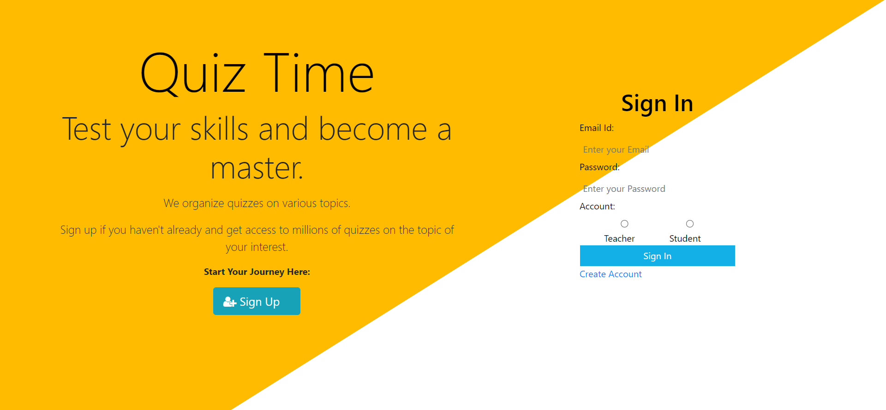
*Register page
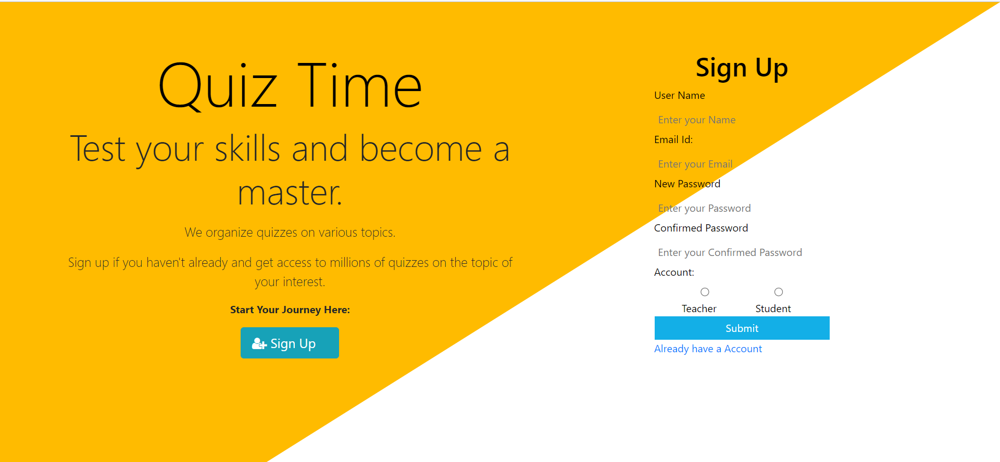

* Teacher
* Teacher Dashboard
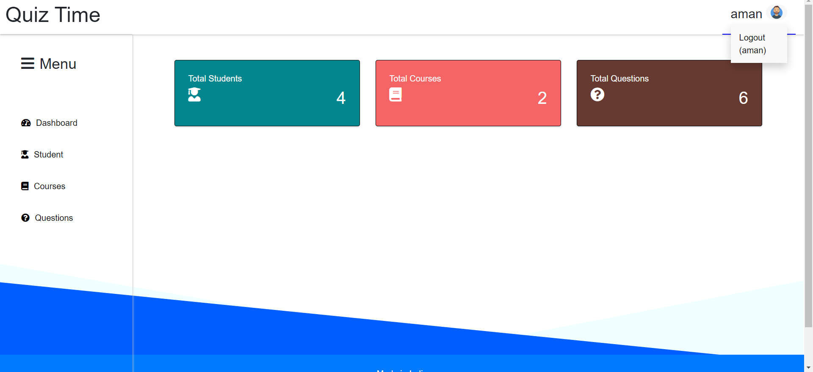
* Teacher Add course page
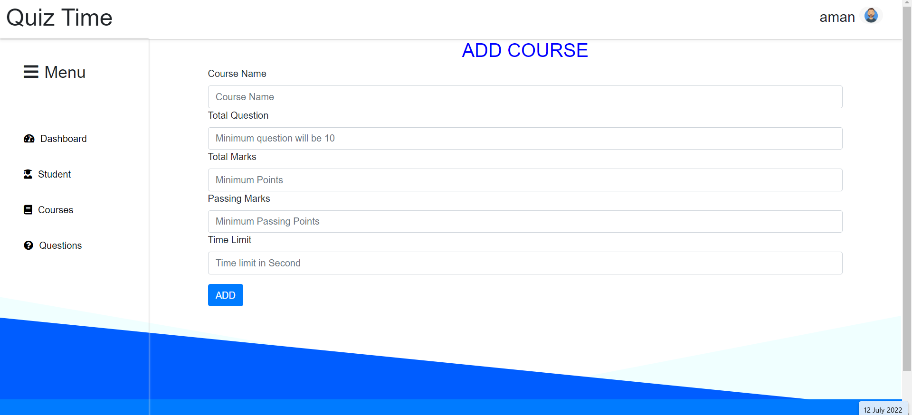
* All Course question
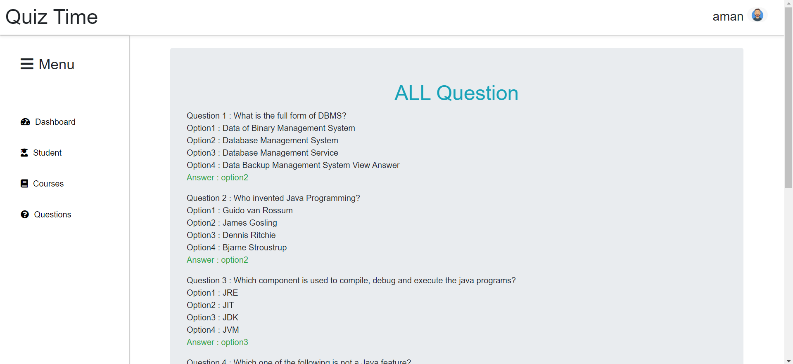
* Student enroll detail in teacher Account
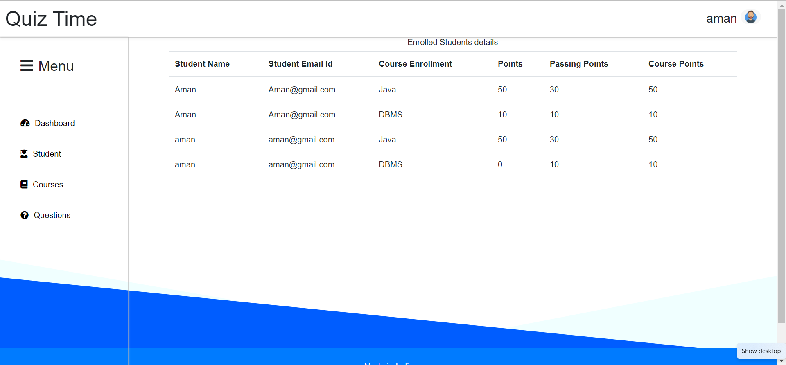

* Student
* Student Dashboard
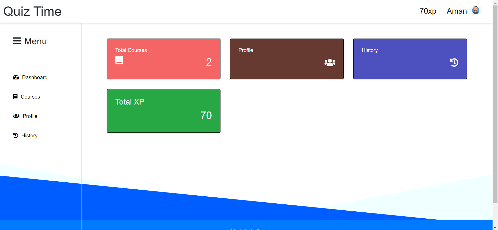
* All course
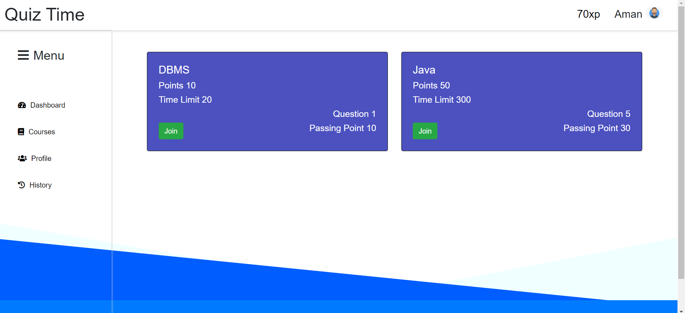
* Student Test history
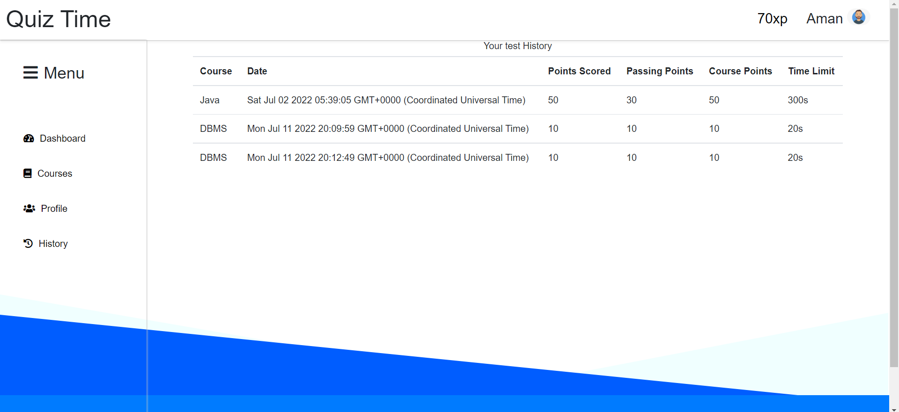
* Student Test Dashboard
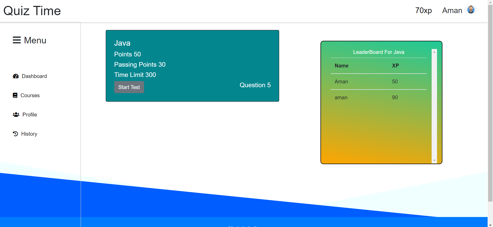
* Test instruction
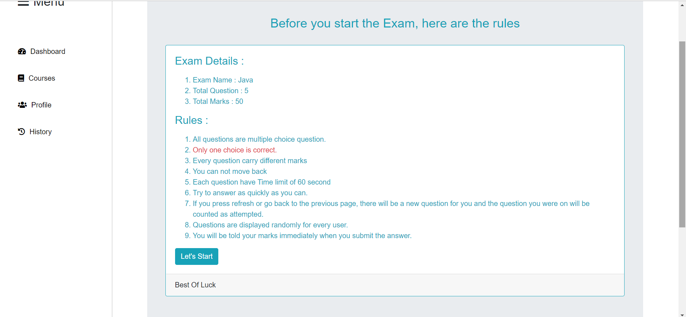
* Mcq Layout
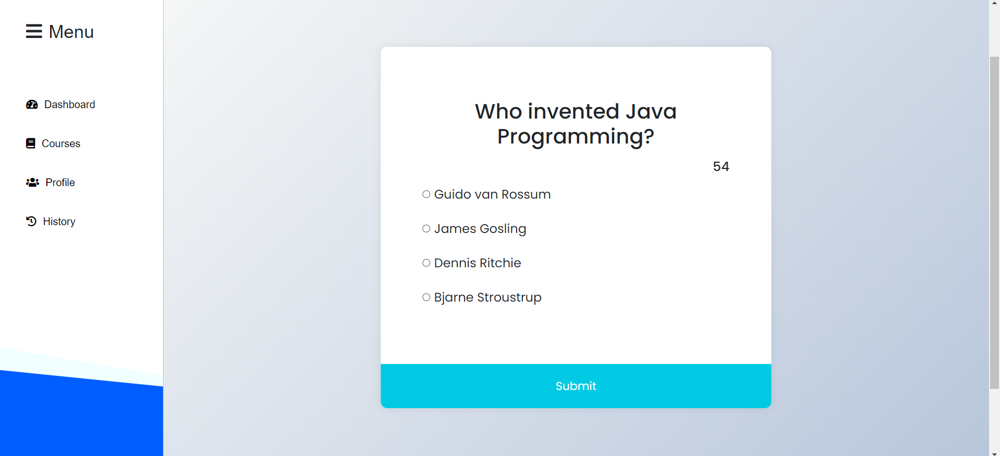
* Result Layout
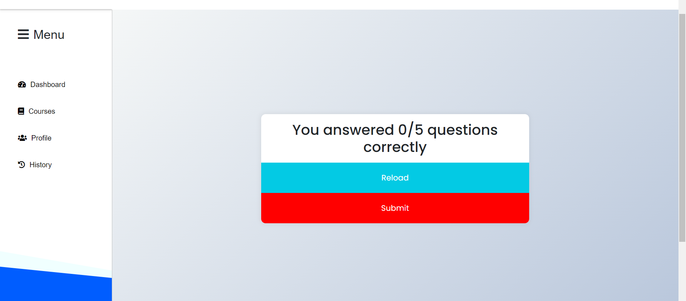